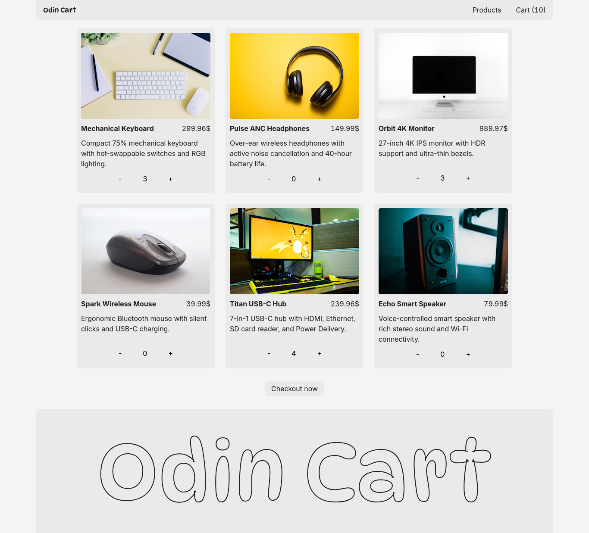

# Odin shopping cart

This project is a shopping cart website with react router.



There are 3 pages:

- Home
- Products
- Cart

Now the pages are divided into folders. Layout is well the `layout` it is common for every page.
The folders have the css modules and those are imported.

Styling was done in `App.css` and `index.css` is a css reset.

Routes are defined in `main.jsx`

Props drilling was used to manage state for the json data. Its mutilated at download to add `count`

All the test files are in the test folder and only tests dynamic features.

There is `errorBoundary` in misc folder.

Data is fetched with browsers fetch API.

## Getting started

Installation

```bash
git clone https://github.com/golam71/odin-shopping-cart
cd odin-shopping-cart
npm install
```

Running Live

```bash
npm run dev
```

Running tests

```bash
npm run test
```
